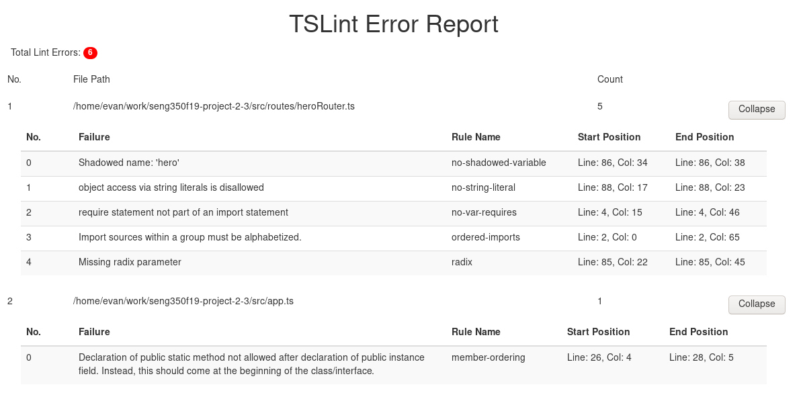

## Static Analysis Report
Our static analysis was through 'linting' all our typescript source files via the tslint tool (more specifically the command `tslint -c tslint/tslint.json '../src/**/*.ts'`).  

After getting rid of all trivial errors (such as missing semicolons, uneccessary spacing / wrong spacing) we had six major errors that tslint identified.



### Starting from the top the solutions for each errors are as follows:

> Shadowed name: 'shoe'
In our heroRouter.ts we had the line
`const shoe = Heroes.find((shoe: any) => shoe.id === query);`
so to prevent shadowing we merely changed `shoe: any` to `element: any`

> object access via string literals is disallowed
Originally we had the line 
`shoe["diff"] = shoe.current_price - shoe.retail_price;`
The error references the "diff" so instead we put the string into a variable and referenced the variable instead of the string directly

> require statement not part of an import statement
This error was probably the most involved. For this to be fixed we needed to change how we were importing our data.json file. This begins with the creation of a "json.d.ts" file with the following contents:
```
// Allows us to load .json files
declare module "*.json" {
  const value: any;
  export default value;
}
// Allows us to load JSON from remote URL responses
declare module "json!*" {
  const value: any;
  export default value;
}
// Code gathered from https://nono.ma/says/load-a-json-file-with-typescript
```
From there we needed to add this line in our "tsconfig.json" => "resolveJsonModule": true
And finally correct the import statement: `import Shoes = require("../../dist/data.json");`


> import sources within a group must be alphabetized
This one isn't so major, was just hard to debug as tslint's definition of alphabetized sources is unintuitive (they're just picky with order of '../' vs '../../')

> Missing radix parameter
This one was interesting as well as it turns out there is a radix parameter within the `parseInt()` function. So all we needed to do was add the parameter `10` to indicate it would parse in base 10.

> Declaration of public static method ...
This was a struggle to figure out as we used the boilerplate `app.ts` file that was given to us in the lab and we didn't expect it to fail the static analysis test. It turns out that 
```public static bootstrap(): Server {
        return new Server();
    }

    public app: express.Application; ```
is tslints preferred ordering of the public static method and public instance, not vice versa. 

After the above changes were made, the code managed to pass tslints linting as a whole!
